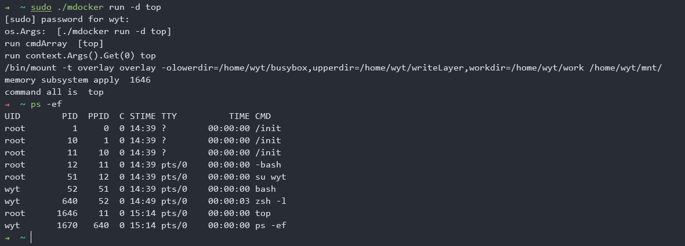

# 第三章

1.Linux下的/proc文件系统是内核提供的，它其实不是一个真正的文件系统，只包含了系统运行时的信息（比如内存、mount设备、硬件配置等）
**只存在于内存中，不占用外存空间**。它以文件系统的形式存在，为访问内核数据的操作提供接口。
实际上，很多系统工具都是简单地去读取这个文件系统的内容，比如lsmod就是cat/proc/modulse

当遍历这个目录时，会发现很多数字，这是为进程创建的空间，数字就是pid。

/proc/N PID 为N的进程信息
/proc/N/cmdline 进程启动命令
/proc/N/cwd 链接到进程当前工作目录
/proc/N/environ 进程环境变量列表
/proc/N/exe 链接到进程的执行命令文件
/proc/N/fd 包含进程相关的所有文件描述符
/proc/N/maps 与进程相关的内存映射信息
/proc/N/mem 指代进程持有的内存，不可读
/proc/N/root 连接到进程的根目录
/proc/N/stat 进程的状态
/proc/N/statm 进程使用的内存状态
/proc/N/status 进程状态信息，比stat/statm更具可读性
/proc/self 链接到当前正在运行的

# 第四章

利用overlay来实现镜像与容器的分离，在镜像的基础上创建容器，镜像是readonly，更改容器的内容不会影响到镜像。

为了能够保留对容器的改动，需要实现volume数据卷功能。

使用overlay创建容器文件系统的过程如下：
- 创建只读层（busybox）
- 创建容器读写层
- 创建挂载点，并把只读层和读写层挂载到挂载点
- 将挂载点作为容器的根目录

容器退出时：
- 卸载挂载点的文件系统
- 删除挂载点
- 删除读写层

加入创建volume后，在创建容器文件系统的过程中，由原有过程变成
- 创建只读层（busybox）
- 创建容器读写层
- 创建挂载点，并把只读层和读写层挂载到挂载点
- 判断volume是否为空，如果是，就表示用户并没有使用挂载标签，结束创建过程
- 如果不为空，则使用volumeUrlExtract函数解析volume字符串
- 当volumeUrlExtract函数返回的字符串长度为2，并且数据元素均不为空的时候，则执行Mount Volume函数来挂载数据卷
- 否则，提示用户创建数据卷输入值不对

挂载数据卷的过程如下：
- 首先，读取宿主机文件目录URL，创建宿主机文件目录(~/${parentUrl})
- 然后，读取容器挂载点URL，在容器文件系统里创建挂载点(~/mnt/${containerUrl})
- 最后，把宿主机文件目录挂载到容器挂载点。这样启动容器的过程，对数据卷的处理也就完成了。这里就是操作docker中对应的目录实际上是在操作挂载的物理机目录

```go
dirs := "-olowerdir=" + readonlyDir + ",upperdir=" + parentUrl + ",workdir=" + workDir
cmd := exec.Command("mount", "-t", "overlay", "overlay", dirs, containerVolumeUrl)
```
这里挂载的时候，readonlyDir是创建的一个空文件夹，没啥用，parentUrl是指定的要挂载的文件夹，workdir不能在parentUrl内！containerVolumeUrl是映射的容器路径

删除容器文件系统的过程如下。
- 只有在volume不为空，并且使用volumeUrlExtract函数解析volume字符串返回的字符数组长度为2，数据元素均不为空的时候，才执行DeleteMountPointWithVolume函数。
- 其余情况仍然使用前面的DeleteMountPoint函数

DeleteMountPointWithVolume函数处理逻辑如下：
- 卸载volume挂载点的文件系统(~/mnt/${containerUrl})，保证整个容器的挂载点没有被使用
- 再卸载整个容器文件系统的挂载点(~/mnt)
- 删除容器文件系统挂载点，整个容器退出过程中的文件系统处理结束

镜像打包

容器退出时会删除所有可写层的内容，mydokcer commit命令的目的就是把运行状态容器的内容存储成镜像保存下来。

# 第五章

## 1 实现容器后台运行的功能

在早期的docker中，所有的容器init进程都是从docker daemon这个进程fork出来的，这也就会导致一个问题：如果docker daemon挂掉，那么所有的容器都会宕掉。

后来docker使用了containerd，也就是现在的runC。

要理解runc，我们需要了解容器标准OCI（Open Container Initiative）可以理解为容器运行标准，是由多个组织共同成立，主要是维护runc的标准协议和相关的开发工作。所谓的runc主要是负责容器生命周期的管理，以及对容器状态的描述。

runc实现了容器的init，run，create，ps...我们在运行容器所需要的cmd。
runc的项目可以分为2个部分，
第一个就是底层隔离，网络等实现，这个主要在libcontainer中实现，这一层主要是对操作系统调用的封装,还有就是对docker文件系统的实现。
第二层就是提供基础容器cmd调用，比如提到的create，ps等cmd. 基本runc主要是这2块功能，其实只要有这2大块功能，其实就可以自己实现对container生命周期管理了。以下我将解析几个cmd来说明怎么调用的libcontainer。

这里与runC类似，采用detach（子进程与父进程分离）的方式，实现创建完成容器后，mydocker就会退出，但容器依然运行。

原理：由操作系统角度来看，容器就是一个进程，运行命令的mydocker是主进程，容器是被当前mydocker进程fork出来的子进程。子进程的结束和父进程的运行是一个异步过程，即父进程永远不知道子进程到底什么时候结束。
如果创建子进程的父进程退出，那么这个子进程就成了没人管的孩子，俗称**孤儿进程**。为了避免孤儿进程退出时无法释放所占用的资源而僵死，**进程号为1的进程init就会接受这些孤儿进程**。

因此，当mydocker退出后，容器进程就会被进程号为1的init进程接管，这是容器进程还是运行的，这样就实现了mydocker退出、容器不宕掉的功能。

这里代码的实现方式是在run.go中的parent.Wait()处加上判断



这里的ppid是11，也是init
## 2 查看运行中的容器

实现mydocker ps命令。该命令是去约定好的位置查询一下容器的信息数据，然后显示出来。

因此需要将容器的信息：PID、创建时间、运行命令等都记录下来，ps的时候直接查看这些信息。

虽然docker ps能看到后台运行中的容器，但如果查看后台运行中的容器日志的话，需要将容器中的标准输出保存下来。将容器进程的标准输出挂载到``/var/run/mydocker/容器名/container.log``文件中。
