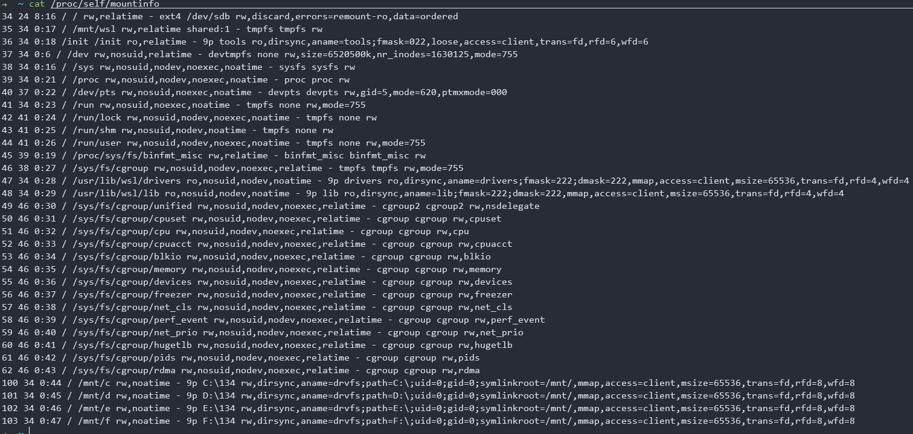

# 描述
mdocker是仿照《自己动手写docker》实现的docker容器，自己动手写docker是基于linux内核4.0之前的AUFS实现的文件系统，本项目采用的是基于linux内核5.10版本的wsl2开发的，采用的是overlay来实现的文件系统

# 详解

main.go中的main函数中就是注册了一些操作，然后``app.run(os.Args())``通过解析控制台传来的参数来执行注册的操作。

main_command中实现了这些操作，最主要的就是run操作。

run.go中实现了run操作。run操作
- 第一步通过container_process.go拿到cmd和一个写管道，这个cmd的命令是再调用该进程，即./mdocker，即运行的docker进程（容器的父进程），并且传入的参数是init，即该cmd就是再调用docker执行init命令。并且在执行这个命令时传入的参数创建了新的namespace，能够与宿主机隔离。同时创建容器的文件系统和文件映射；
- 第二步通过cmd.start()运行cmd的命令，即注册的**init操作**,init操作调用了容器的RunContainerInitProcess()函数；
- 第三步保存容器信息到文件中；
- 第四步**创建cgroup来限制资源**；
- 第五步通过管道将运行的参数传送给容器；
- 第六步判断是否tty，如果是，则父进程wait()；
- 第七步删除掉文件系统，并且退出（目前这里有问题，如果不是tty，即后台运行，那么默认会把文件系统删除掉，则不能再进入）


### init操作

- 1.先读出通过管道传来的参数
- 2.挂载文件系统，先设置root路径，然后dev，proc挂载
- 3.执行传入进来的参数，即对应的命令。这里采用的syscall.Exec(path, cmdArray, os.Environ())会执行path对应的程序，并覆盖当前进程的镜像、数据和堆栈等信息，包括PID等信息。即调用这个系统调用，将用户指定的进程运行起来，把最初的init进程替换掉，这让进入容器后，容器内第一个（pid=1）的程序就是指定的进程了

### cgourp资源限制

这里抽象出资源接口，每种资源都实现这个接口。

```go
type Subsystem interface {
	// Name 返回subsystem的名字，如cpu，memory
	Name() string
	// Set 设置某个cgroup在这个Subsystem中的资源限制
	Set(path string, res *ResourceConfig) error
	// Apply 将进程添加到某个cgroup中
	Apply(path string, pid int) error
	// Remove 移除某个cgroup
	Remove(path string) error
}
```

- Set就是将对应的限制写到对应的路径的文件中，如memory.limit_in_bytes文件
- Remove就是将这个路径的文件删掉
- Apply将pid写入到这个路径的task文件中
- Name返回对应的cgroup类型名，如memory

现在问题来了，如何找到这个路径，这个路径是对应的subsystem挂载的hierarchy相对径路对应的cgroup在虚拟文件中的路径，然后通过这个目录的读写去操作cgroup。

那么如何找到挂载了subsystem的hierarchy的挂载目录呢？

cat ``/proc/{pid}/mountinfo``



为什么查看进程的mount信息能找到挂载的目录呢?cgroup的hierarchy的虚拟文件系统是通过cgroup类型文件系统的mount挂载上去的。那么在对应的文件夹下创建cgroup，就可以做到内存限制。

因此通过``/proc/self/mountinfo``找到对应的目录，然后在目录中创建``mydocker-cgroup``目录（这里应该以容器名字命名），用于存储容器的资源限制

